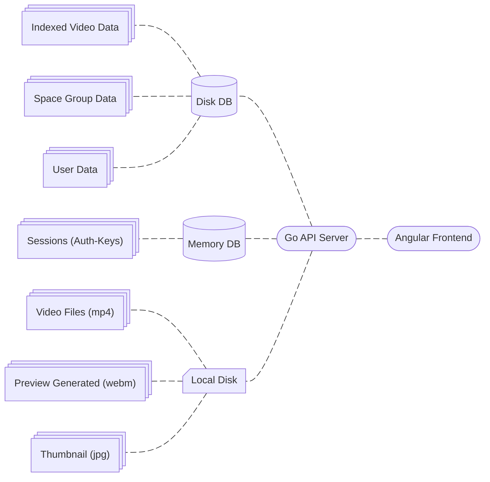

<!--
{
	"nav_order": 2
}
-->

# Architecture

here we showing how ova workign and the architecture behind that.

---

## How its working ?

it index all videos to a database as global db of all videos.
each video can be private or public and also have an `uploader_user_id`

when each user register the system create and `User_Id` that different from the `username`.
the `username` can chnage but the `user_id` never ever changing.

the sessions are bind with teh `user_id`

### Global Video Collection

A central place where all videos are indexed with a unique video_id and a path to the video file.
Videos are either private or public, depending on user settings.

See the Video Data here: [Video Data](/docs/datatypes/videodata)

all vides showing on the each person profile.

### Space Feature (Top of Global Videos)

Space is another feature that make the videos grouping. also the spacing have the Visibility Property.

See the Space Data here: [Space Data](/docs/datatypes/spacedata)

Create Spaces based Path.
this create spaces based the folders.
we don't have any concept like nesting spaces.

i thinking about a top level thing that we can send the Spaces to a something that are top level.

for example we category the some videos to a space that is about art.
then the broadcasting want play them. we send them to somethng htat is more top level and it holds multiple spaces.
i don't know what name is good maybe its good to

i thinking abotu that we can do more for example writing something or

i thinking about the Visibility level for

i Thinking about this that each user own the Spaces and Videos.
and can Public them.

if a Video is Private but Space is Public what abotu that ?

### Restrict Access to Private Videos

In this model:

Public Space: The space is visible to everyone.

Private Video: Even though the space is public, a private video is not accessible unless the user has specific permissions to view that video.

also i thinking about the relative or absolute paths.
because the video data is stored on the db and it fetch to the client msut the path be relative to that disk ?
which one is better ?
