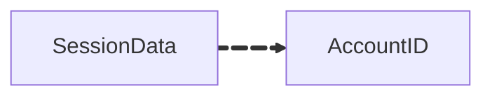

# Session Data

this data used for

## Index Relations

The space data references video IDs, linking to the [Video Data](/docs/datatypes/videodata)



---

## Data Structure

```yaml
Session Data:
  - SessionID: string
  - AccouuntID: string
```
