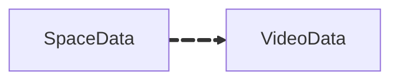

# Space Data

Space data is used to organize videos into collections, similar to playlists. Each space groups related videos together, making it easier to manage and navigate content. Spaces can be public or private, and are defined by a unique set of video IDs, providing users with control over the content within each collection.

---

## Data Structure

```yaml
Space Data:
  - OwnerAccountId: string
  - SpaceID: string # A unique identifier for the space
  - SpaceTitle: string # The title or name of the space, displayed to users
  - VideoIDs: array of strings # List of Video IDs associated with this space
  - Visibility: string # Visibility status of the space, e.g., 'public' or 'private'
  - CreatedByAccountId: string # Account ID of the user who created the space
  - Description: string # A brief description or summary of the space's purpose or content
  - CreatedAt: datetime # Timestamp when the space was created
  - UpdatedAt: datetime # Timestamp of the last update made to the space (e.g., adding/removing videos)
```

## Index Relations

The space data references video IDs, linking to the [Video Data](/docs/datatypes/videodata)


