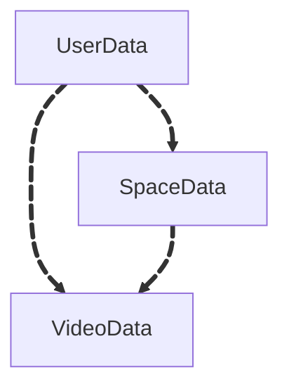

# User Data

Space data is used to organize videos into collections, similar to playlists. Each space groups related videos together, making it easier to manage and navigate content. Spaces can be public or private, and are defined by a unique set of video IDs, giving users control over the content within each collection.

---

## Data Structure

```yaml
User Data:
  - AccountID: string # Unique identifier for the user account
  - Username: string # The username of the user
  - PasswordHash: string # The hashed password for authentication
  - UploadedVideoIds: array of strings # List of Video IDs uploaded by the user
  - SpacesCreatedIds: array of strings # List of Space IDs created by the user
  - Favorites: array of strings # List of Video IDs marked as favorites
  - Playlists: # Embedded list of the user's playlists
      - PlaylistID: string # Unique identifier for the playlist
      - PlaylistTitle: string # Title or name of the playlist
      - VideoIDs: array of strings # List of Video IDs in the playlist
      - CreatedAt: datetime # Timestamp when the playlist was created
      - UpdatedAt: datetime # Timestamp when the playlist was last updated
  - Watched: array of strings # List of Video IDs the user has watched
  - CreatedAt: datetime # Timestamp when the user profile was created
  - LastLoginAt: datetime # Timestamp of the last login (optional)
```

## Index Relations

The user data references both space IDs and video IDs, linking to the [Video Data](/docs/datatypes/videodata) and [Space Data](/docs/datatypes/spacedata).


