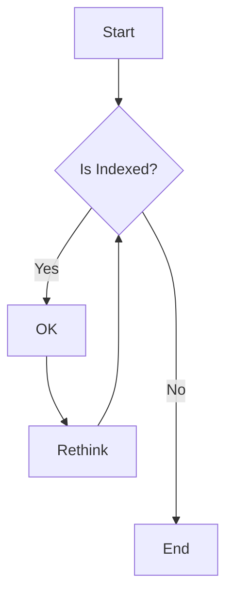

# Indexing

To ensure every video file is uniquely identified, a checksum is generated for each file. This checksum acts as a unique fingerprint, helping to prevent duplicates and enabling reliable file tracking.

## Default User

when indexing with the cli .. and videos on the disk.
by default it using the `root` user.

